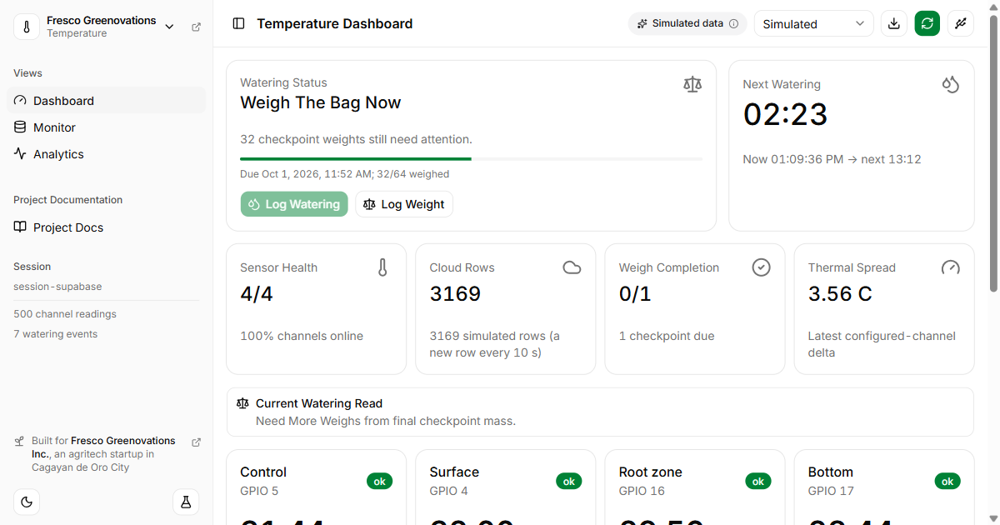

# Fresco Grow Lab

Grow-bag temperature and rain gauge telemetry: ESP32 firmware (PlatformIO)
plus a Next.js dashboard.

Built for **Fresco Greenovations Inc.** ([fresco.ph](https://fresco.ph/)), an
agritech startup in Cagayan de Oro City, Philippines.



## What it does

- **Runs without hardware:** both dashboards start on live simulated data.
- **Bring your own sensors:** flash an ESP32 from the browser, stream it over
  USB, or point the dashboard at your own Supabase (**Connect Hardware**).
- **Analytics:** probe trends, a thermal heatmap, depth profile, watering and
  weight checkpoints; rain events, intensity, totals and calibration.

## Quick start

```bash
cd web
npm install
npm run dev        # http://localhost:3000, simulated data, no setup needed
```

For Supabase, copy `web/.env.example` to `web/.env.local` and see [Data](docs/data.md).

**Deploy (Vercel):** root directory `web`, keep "Include files outside the
root directory" on, and add the env vars. Without them the site still runs on
simulated data and USB.

## Repository

| Path | Contents |
| --- | --- |
| `src/`, `include/`, `platformio.ini` | Firmware ([Hardware](docs/hardware.md)) |
| `web/` | Dashboard (`npm run lint / typecheck / test / build`) |
| `supabase/` | Migrations, policies, views, seed ([Data](docs/data.md)) |
| `docs/` | [Hardware](docs/hardware.md) · [Data](docs/data.md) · [Experiments](docs/experiments.md) |

## Credits

Built for **Fresco Greenovations Inc.** ([fresco.ph](https://fresco.ph/)),
Cagayan de Oro City, for its grow-bag and rain-gauge experiments. Dashboard,
firmware and data pipeline by John Carl Ramirez. The Fresco Greenovations name
belongs to its owners.
